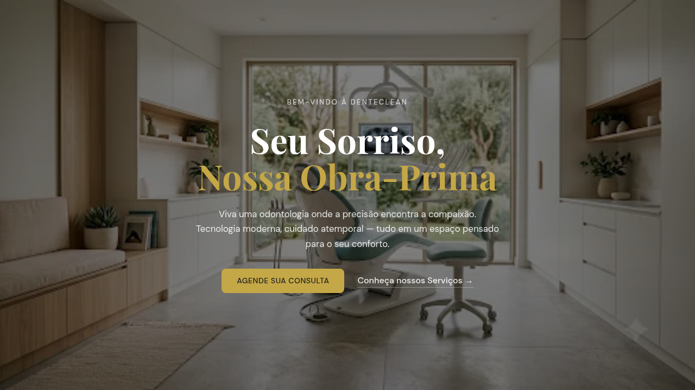
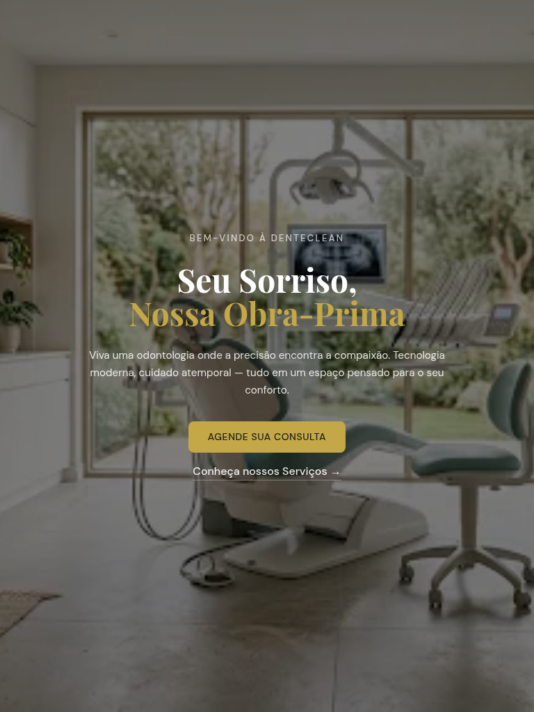
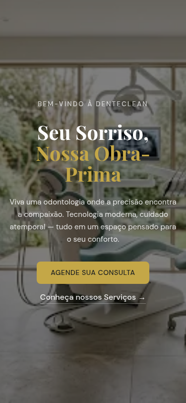

# DenteClean — Landing Page de Clínica Odontológica Premium

[](LICENSE)
[](#-idioma)

> ⚠️ **Idioma**: O conteúdo do site está em **português brasileiro**. Este README documenta o projeto em português. Uma [versão em inglês](README.md) também está disponível.

Site institucional de página única para uma clínica odontológica premium (fictícia). HTML5, CSS3 e JavaScript puro. **Sem frameworks. Sem etapa de build. Sem backend.**

---

## Pré-visualização

| Desktop | Tablet | Mobile |
|:---:|:---:|:---:|
|  |  |  |

---

## Índice

- [Começando](#come%C3%A7ando)
- [Seções da Página](#se%C3%A7%C3%B5es-da-p%C3%A1gina)
- [Funcionalidades Técnicas](#funcionalidades-t%C3%A9cnicas)
- [Personalização](#personaliza%C3%A7%C3%A3o)
- [Sistema de Design](#sistema-de-design)
- [Stack Tecnológica](#stack-tecnol%C3%B3gica)
- [Estrutura do Projeto](#estrutura-do-projeto)
- [Compatibilidade](#compatibilidade)
- [Testes](#testes)
- [Contribuindo](#contribuindo)
- [Licença](#licen%C3%A7a)

---

## Começando

```bash
git clone https://github.com/DaviMGDev/denteclean.git
open denteclean/index.html
```

Ou sirva o diretório com qualquer servidor de arquivos estáticos:

```bash
npx serve denteclean/
python3 -m http.server -d denteclean/
```

Sem `npm install`, sem build, sem dependências.

---

## Seções da Página

- **Hero** — Cabeçalho em tela cheia com imagem de fundo, vinheta escura e dois CTAs para agendamento e serviços.
- **Serviços** — Três procedimentos (limpeza, clareamento, implantes) em layout editorial alternado com badges e modais de detalhes.
- **Sobre Nós** — Seção dividida com foto da clínica, missão, citação da fundadora e depoimento de paciente.
- **Equipe** — Três perfis em layouts distintos (retrato grande, compacto com texto primeiro, imagem deslocada) com faixa de estatísticas.
- **Contato** — Layout de duas colunas com cartão de informações (endereço, telefone, e-mail, horários) e formulário de agendamento.
- **Rodapé** — Três colunas em fundo escuro com marca, links rápidos e referências legais.

---

## Funcionalidades Técnicas

- **Sistema de modal** — Acessível, navegável por teclado (`Escape` para fechar, foco automático, clique no fundo). Renderiza dinamicamente detalhes de serviços e CTA de agendamento.
- **Validação de formulário** — Estados de erro inline com mensagens visíveis para leitores de tela. Submissão simulada com feedback toast.
- **Notificações toast** — Feedback animado e não intrusivo. Descarte automático após 3 segundos. Container com `aria-live="polite"`.
- **Animação ao scroll** — Fade-in via Intersection Observer com atrasos escalonados. Fallback para navegadores antigos.
- **Design responsivo** — Tipografia fluida com `clamp()`, dois breakpoints (900px e 600px), layouts de múltiplas colunas colapsam para coluna única no mobile.
- **Skip link** — Link "ir para o conteúdo" oculto que aparece ao receber foco, para navegação por teclado.
- **Container de scroll seguro** — Elemento raiz usa `100dvh` com fallback para `100vh`, lidando corretamente com a barra de endereço em navegadores mobile.

---

## Personalização

### Substituir Informações da Clínica

Todo o conteúdo textual está no `index.html`. Busque e substitua os seguintes valores para adaptar a uma clínica real:

- Nome da clínica: `DenteClean` → seu nome (tag title, hero, rodapé)
- Telefone: `(41) 99842-0142` → seu número (seção de contato, modal de agendamento no `app.js`)
- E-mail: `contato@denteclean.com.br` → seu e-mail
- Endereço: `Rua Serenidade, 123, Sala 200` → seu endereço (~linha 440 no `index.html`)
- Horários: Edite o texto da seção de horários no cartão de contato
- Equipe: Substitua nomes, cargos, descrições e badges na seção da equipe
- Redes sociais: Atualize as mensagens toast nos botões de redes sociais (links reais não implementados)

### Substituir Imagens

Todas as imagens estão em `assets/images/`. Substitua qualquer arquivo `.webp` mantendo o mesmo nome, ou atualize o atributo `src` no `index.html`. Formato suportado: WebP.

### Alterar Cores

Todas as cores são definidas como propriedades CSS customizadas no bloco `:root` no topo do `style.css`. Edite os valores diretamente:

```css
--primary: #1B1F22;       /* Tinta escura — títulos, botões */
--accent-gold: #C4A747;   /* Cor de destaque — CTAs principais */
--tertiary: #3A4F41;      /* Verde sage — labels de seção */
--neutral-warm: #F5F3EF;  /* Fundo da página */
```

### Alterar Fontes

As fontes do Google são carregadas no `<head>` do `index.html`. Troque os nomes das famílias ali e depois atualize as variáveis `--font-display` e `--font-body` no `style.css`.

---

## Sistema de Design

A linguagem visual está documentada em dois formatos:

- **[`design/design.md`](design/design.md)** — Especificação completa do design system no formato [DESIGN.md](https://github.com/google/design.md). Define cores, tipografia, espaçamento, elevação, formas, componentes, iconografia e diretrizes de imagens.
- **[`design/index.is`](design/index.is)** — Protótipo wireframe em notação [InterSpec](https://github.com/anthropics/interspec) descrevendo layout, interações e comportamento responsivo de cada seção.

Princípios-chave: profundidade tonal em vez de sombras, containers com arco superior, único acento dourado por viewport, motivos de linha botânica como acentos estruturais.

---

## Stack Tecnológica

| Camada | Tecnologia |
|---|---|
| Marcação | HTML5 (semântico, landmarks ARIA) |
| Estilização | CSS3 (propriedades customizadas, `clamp()`, flexbox, `dvh`) |
| Script | JavaScript (ES6, Intersection Observer, IIFE) |
| Imagens | WebP |
| Docs de design | DESIGN.md + InterSpec |
| Testes | Playwright |

**Zero dependências em tempo de execução.**

---

## Estrutura do Projeto

```
denteclean/
├── index.html              # Site de página única
├── style.css               # Folha de estilos com design tokens
├── app.js                  # Modais, validação, scroll reveal, toasts
├── LICENSE                 # MIT
├── design/
│   ├── design.md           # Especificação do design system
│   └── index.is            # Wireframe InterSpec
├── assets/
│   └── images/             # 9 imagens WebP
├── tests/
│   └── playwright/         # Estrutura para testes E2E
├── screenshots/            # Imagens de pré-visualização
└── .gitignore
```

---

## Otimização de Imagens

Imagens raster foram convertidas de PNG para WebP usando ImageMagick (qualidade 85, metadados removidos), reduzindo o tamanho total de 3,8 MB para 268 KB — uma **redução de 93%**.

---

## Compatibilidade

Testado e funcionando em:

- Chrome 90+
- Firefox 90+
- Safari 15+
- Edge 90+

Requer suporte a CSS custom properties, `clamp()`, Intersection Observer e unidades `dvh`. Sem suporte para IE11.

---

## Testes

O diretório `tests/playwright/` contém a estrutura inicial para testes end-to-end usando [Playwright](https://playwright.dev/).

---

## Contribuindo

Este é um projeto pessoal de portfólio. Relatos de bugs e sugestões são bem-vindos via GitHub issues. Para mudanças substanciais, abra uma issue primeiro para discutir o que gostaria de alterar.

---

## Licença

[MIT](LICENSE) © 2026 DaviMGDev
